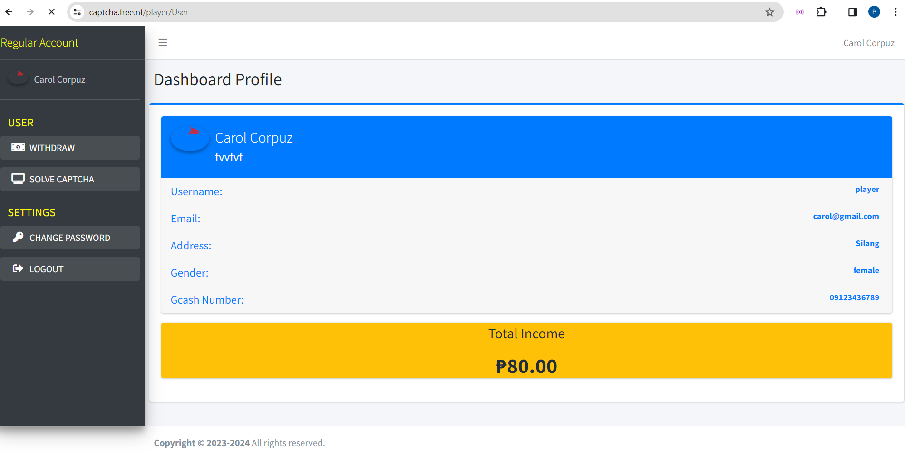
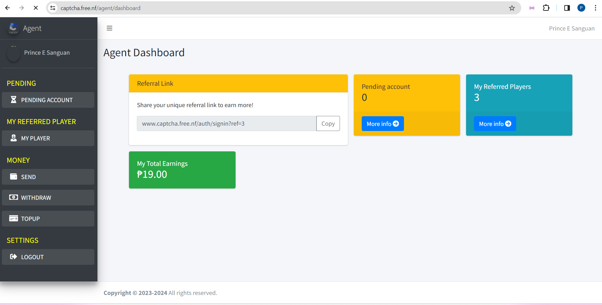
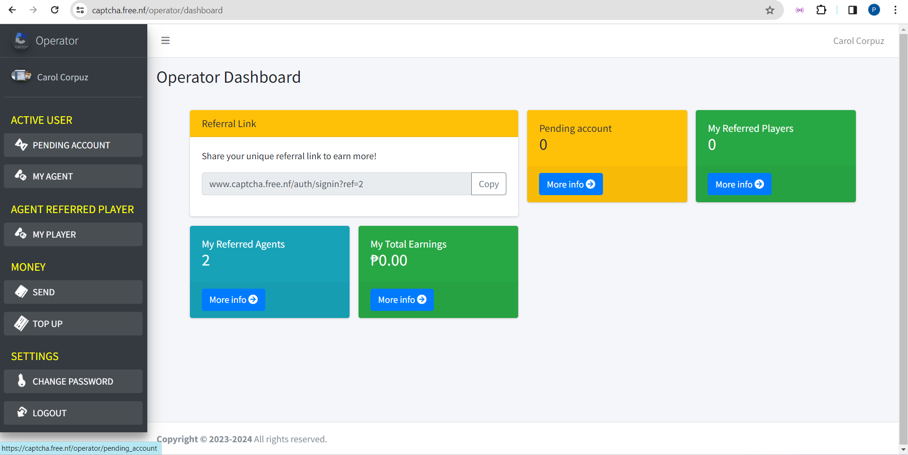
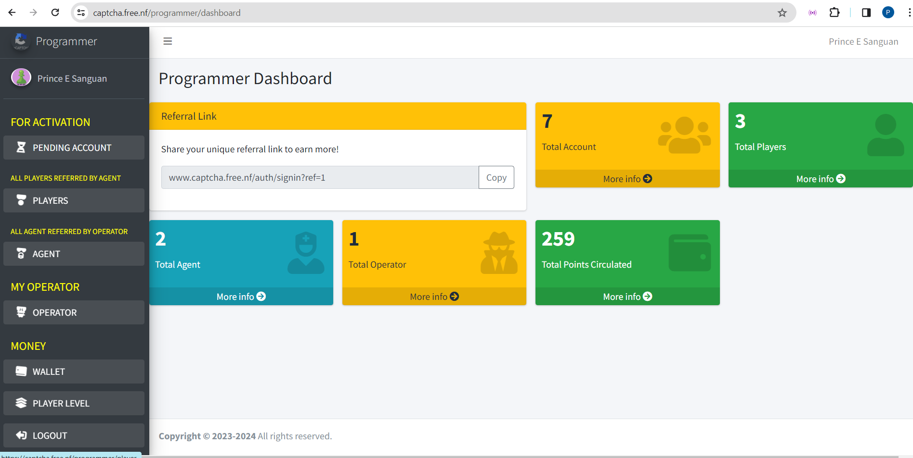

# Crypto Captcha

Crypto Captcha is a Laravel-based web application designed for seamless cryptographic captchas. With distinct dashboards for players, agents, operators, and programmers, the platform offers a multifaceted experience. The player dashboard ensures a smooth gaming experience, while the agent dashboard facilitates referral tracking through a user-friendly system. Operators can manage and oversee activities efficiently, and programmers have dedicated tools for continuous improvement. The platform's appeal lies in its robust structure, fostering collaboration among multiple users. Visit Crypto Captcha for an immersive cryptographic journey, where security meets engagement. Join the community and experience the future of captchas.

Explore distinct dashboards tailored for various roles:

-   **Player Dashboard**
    

-   **Agent Dashboard**
    

-   **Operator Dashboard**
    

-   **Programmer Dashboard**
    

Dive into the captivating world of cryptographic challenges and seamless user experiences. The platform boasts a referral system, enhancing engagement and interaction among users.

Check it out at [Crypto Captcha](https://www.captcha.free.nf) and configure the image paths based on your project structure. Join the community and witness the future of captchas, where security meets innovation.
